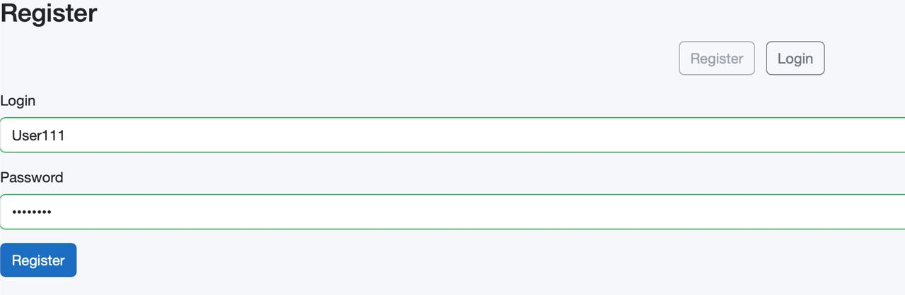
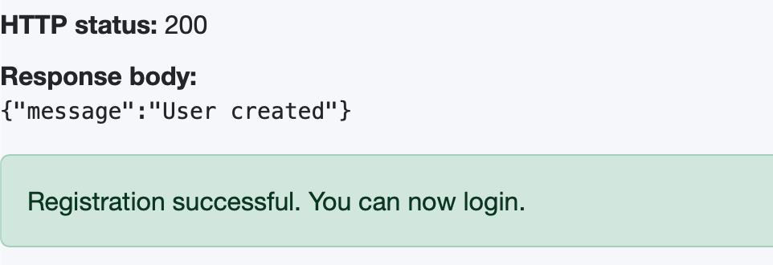
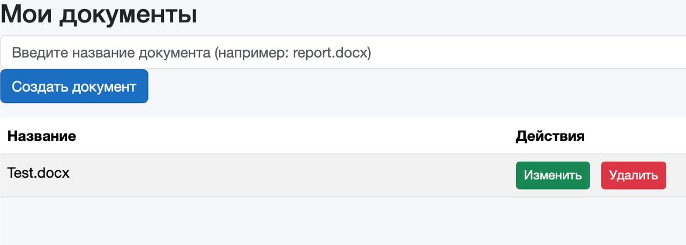

# WebOffice


WebOffice — это современная веб-система для онлайн-редактирования офисных документов с полной интеграцией OnlyOffice Document Server через протокол WOPI. Пользователи могут удобно создавать новые файлы, загружать существующие документы в форматах .docx, .xlsx, .pptx и других совместимых расширениях, а затем полноценно редактировать их прямо в браузере в знакомом и мощном интерфейсе OnlyOffice. Система обеспечивает надёжное сохранение всех изменений и стабильную работу с документами любого объёма.

Проект построен на актуальном стеке .NET 9: backend реализован на ASP.NET Core 9 с Entity Framework Core, frontend полностью на Blazor WebAssembly (без JavaScript), файлы хранятся в объектном хранилище MinIO. Всё легко запускается локально через Docker Compose одной командой — достаточно скопировать .env, поднять инфраструктуру и запустить приложения через dotnet run. Подходит для личного использования, небольших команд, корпоративного документооборота или как готовая основа для собственных решений без внешних облачных сервисов и подписок.

# Инструкции по запуску

<details>

## Быстрый старт для разработки
1. Склонируйте репозиторий:
   ```bash
   git clone https://github.com/sisharppravi/WebOffice.git
2. Скопируйте файл `.env`

```env
# MinIO
MINIO_ROOT_USER=admin
MINIO_ROOT_PASSWORD=admin123
MINIO_BUCKET=weboffice-files

# OnlyOffice
ONLYOFFICE_JWT_SECRET=78YsTwvZAo646cK0BRZn2yJYps26Wx4M7sfnvzTd0nY=

# Nginx
NGINX_PORT=80
```

3. Запустите backend: `cd WebOffice.Api && dotnet run`

4. Запустите frontend: `cd ../WebOffice.Client && dotnet run`

5. Запустите инфраструктуру `(MinIO + OnlyOffice + Nginx)`: `docker compose up`

Откройте в браузере `http://localhost`

Зарегистрируйте нового пользователя и войдите в систему



Создайте новый документ и отредактируйте его, чтобы убедиться, что интеграция с OnlyOffice работает корректно


</details>

# Использованные технологии

<details>

## Backend (WebOffice.Api)

| Технология| Версия |
|---|---|
| .NET / ASP.NET Core | 9.0 |
| Entity Framework Core | 9.0.14 |
| Microsoft.EntityFrameworkCore.Sqlite | 9.0.14 |
| Microsoft.AspNetCore.Identity | 2.3.9 |
| Microsoft.AspNetCore.Identity.EntityFrameworkCore | 9.0.14 |
| Microsoft.AspNetCore.Authentication.JwtBearer | 9.0.3 |
| Microsoft.IdentityModel.Tokens | 8.16.0 |
| System.IdentityModel.Tokens.Jwt | 8.16.0 |
| Microsoft.AspNetCore.OpenApi | 9.0.8 |
| Swashbuckle.AspNetCore (Swagger) | 9.0.6 |
| Minio (.NET SDK) | 7.0.0 |

## Frontend (WebOffice.Client)

| Технология |Версия |
|---|---|
| .NET / Blazor WebAssembly | 9.0 |
| Microsoft.AspNetCore.Components.WebAssembly | 9.0.8 |

## Docker инфраструктура

| Образ | Версия |
|---|---|
| MinIO | RELEASE.2024-02-17T01-15-57Z |
| OnlyOffice Document Server | 9.3 |
| Nginx | 1.27.0 |

Перед началом работы выполните команду `dotnet ef database update`

Для работы со Swagger перейдите в браузере по адресу `https://localhost:7130/swagger`

</details>


---

Каз 

WebOffice – бұл WOPI протоколы арқылы OnlyOffice Document Server-пен толық интеграцияланған, офис құжаттарын онлайн түрде өңдеуге арналған заманауи веб-негізделген жүйе. Пайдаланушылар жаңа файлдарды оңай жасап, .docx, .xlsx, .pptx және басқа үйлесімді форматтағы құжаттарды жүктеп, таныс әрі қуатты OnlyOffice интерфейсі арқылы оларды тікелей браузерде толықтай өңдей алады. Жүйе барлық өзгерістерді сенімді түрде сақтап, кез келген көлемдегі құжаттармен тұрақты жұмыс істеуді қамтамасыз етеді.
Жоба соңғы .NET 9 стек негізінде құрылған: бэкенд ASP.NET Core 9 және Entity Framework Core арқылы жүзеге асырылған, ал фронтэнд толығымен Blazor WebAssembly (JavaScript жоқ) қолдана отырып жасалған, файлдар MinIO объект сақтау жүйесінде сақталады. Барлығын жергілікті түрде Docker Compose арқылы бір ғана командамен оңай іске қосуға болады — .env файлын көшіріп, инфрақұрылымды баптап, `dotnet run` командасын пайдаланып қосымшаларды іске қосыңыз. Жеке пайдалануға, шағын командаларға, корпоративтік құжат айналымын басқаруға немесе сыртқы бұлттық қызметтер мен жазылымдарсыз өз шешімдеріңіздің дайын негізі ретінде қолдануға жарамды.

# Іске қосу нұсқаулары

<details>

## Дамытуға арналған жылдам бастау
1. Репозиторийді клондаңыз:
   ```bash
   git clone https://github.com/sisharppravi/WebOffice.git

2. .env файлын көшіріңіз 

```env
# MinIO
MINIO_ROOT_USER=admin
MINIO_ROOT_PASSWORD=admin123
MINIO_BUCKET=weboffice-files

# OnlyOffice
ONLYOFFICE_JWT_SECRET=78YsTwvZAo646cK0BRZn2yJYps26Wx4M7sfnvzTd0nY=

# Nginx
NGINX_PORT=80
```
3. Бэкендті іске қосыңыз: cd WebOffice.Api && dotnet run
4. Frontend-ті іске қосыңыз: cd ../WebOffice.Client && dotnet run
5. Инфрақұрылымды іске қосыңыз (MinIO + OnlyOffice + Nginx): docker compose up
Шолғышта http://localhost мекенжайын ашыңыз
   Жаңа пайдаланушыны тіркеп, жүйеге кіріңіз
   
   
   Жаңа құжат жасап, OnlyOffice-пен интеграцияның дұрыс жұмыс істеп тұрғанына көз жеткізу үшін оны өңдеңіз
   
   

</details>

# Қолданылған технологиялар

<details>

## Backend (WebOffice.Api)

| Технология  | Нұсқасы  |
|---|---|
| .NET / ASP.NET Core | 9.0 |
| Entity Framework Core | 9.0.14 |
| Microsoft.EntityFrameworkCore.Sqlite | 9.0.14 |
| Microsoft.AspNetCore.Identity | 2.3.9 |
| Microsoft.AspNetCore.Identity.EntityFrameworkCore | 9.0.14 |
| Microsoft.AspNetCore.Authentication.JwtBearer | 9.0.3 |
| Microsoft.IdentityModel.Tokens | 8.16.0 |
| System.IdentityModel.Tokens.Jwt | 8.16.0 |
| Microsoft.AspNetCore.OpenApi | 9.0.8 |
| Swashbuckle.AspNetCore (Swagger) | 9.0.6 |
| Minio (.NET SDK) | 7.0.0 |

## Frontend (WebOffice.Client)

| Технология | Нұсқасы |
|---|---|
| .NET / Blazor WebAssembly | 9.0 |
| Microsoft.AspNetCore.Components.WebAssembly | 9.0.8 |

## Инфрақұрылым (Docker инфраструктура)

| Образ | Нұсқасы  |
|---|---|
| MinIO | RELEASE.2024-02-17T01-15-57Z |
| OnlyOffice Document Server | 9.3 |
| Nginx | 1.27.0 |

Жұмысты бастамас бұрын `dotnet ef database update` командасын іске қосыңыз 

Swagger-пен жұмыс істеу үшін шолғышта `https://localhost:7130/swagger` мекенжайына өтіңіз 

</details>
